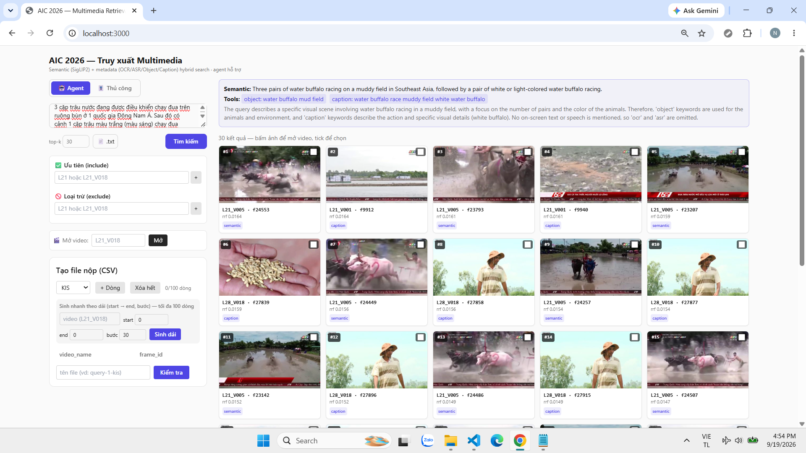
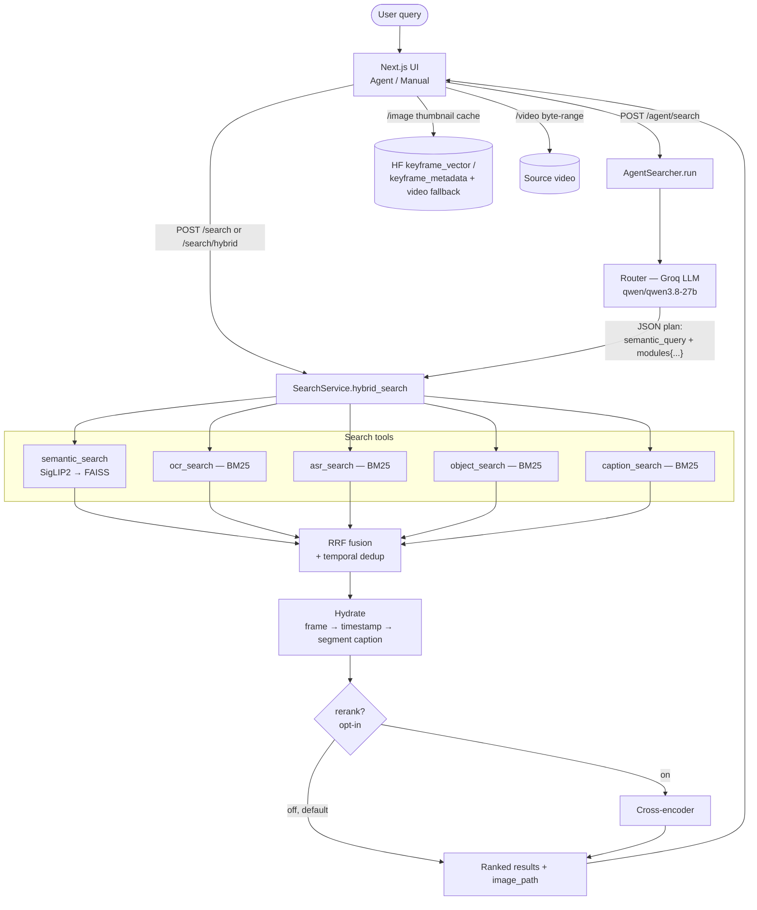
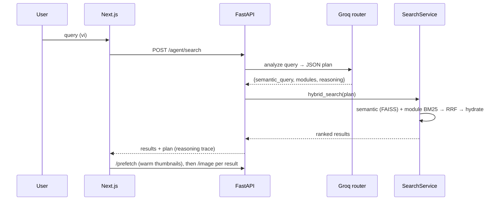

# AIC 2026 — Intelligent Multimedia Retrieval

A video moment–retrieval system for the **Ho Chi Minh City AI Challenge 2026**
(LSC/VBS-style): find the exact keyframe answering a natural-language query over a
large broadcast-video corpus, then export a competition submission.

It combines **semantic search** (SigLIP2 + FAISS) with **metadata search** over
per-frame OCR / ASR / object-detection / captions (BM25), fuses them with
**Reciprocal Rank Fusion**, and adds an **LLM agent** that reads a (Vietnamese)
query and decides which search tools to call. A **Next.js** UI provides a result
grid, a frame-accurate video inspector, video-scope filtering, and a
submission-CSV builder.

> Corpus indexed in development: **409,463 keyframes across 873 videos** (batches L21–L30).
> A detailed, module-by-module walkthrough for study/interview lives in
> [docs/PROJECT_OVERVIEW.md](docs/PROJECT_OVERVIEW.md).

## Interface



Agent mode answering *"3 cặp trâu nước đang được điều khiển chạy đua trên ruộng bùn ở 1
quốc gia Đông Nam Á…"*. The banner shows the plan the LLM produced — an English
`semantic_query` plus the two metadata tools it chose (`object`, `caption`) — and why it
skipped `ocr`/`asr`. Each result card carries its `rrf` score and the source that found it.
The left rail holds video-scope include/exclude, the video opener, and the submission-CSV
builder.

---

## System flow (with the agent)

The system runs in two modes that share the same retrieval core:

- **Manual mode** — the user fills a semantic description and/or per-module keywords.
  *Whatever is filled is searched* (semantic is optional; you can search by metadata
  modules alone).
- **Agent mode** — the user types one natural-language query; a Groq LLM plans it:
  it produces an English `semantic_query` for the image search and picks which
  metadata **tools** to call (with per-tool keywords), keeping Vietnamese for
  on-screen text / speech.

### Tools the agent (or manual mode) can call

| Tool | Backend | Source | Notes |
|------|---------|--------|-------|
| `semantic_search` | SigLIP2 text embed → FAISS `IndexFlatIP` | vector keyframes | Always run when there is query text |
| `ocr_search` | BM25 over on-screen text | metadata keyframes | Keeps Vietnamese |
| `asr_search` | BM25 over speech transcript | metadata segments | Keeps Vietnamese |
| `object_search` | BM25 over detected object labels | metadata keyframes | English labels |
| `caption_search` | BM25 over scene captions | metadata segments | English captions |

Results from the chosen tools are merged with **RRF + temporal dedup**, hydrated
with segment captions, then returned. Cross-encoder reranking exists but is
**off by default** (opt-in).

### Flow diagram



### Sequence (agent mode)



---

## Modules

> The following upstream modules produce the data this system indexes.
> **(Sections intentionally left blank — to be filled in.)**

### ASR

_TBD._

### Object detection

_TBD._

### OCR

_TBD._

### Image-Text Shared Embeddings

_TBD._

### Keyframe selection methods

_TBD._

---

## Features

- **Semantic search** — SigLIP2 (`google/siglip2-base-patch16-224`) text→image over a persistent FAISS index.
- **Metadata search** — four independent BM25 indexes (OCR, ASR, object labels, captions), Vietnamese-aware tokenizer; usable alone or with semantic.
- **Hybrid fusion** — RRF across chosen tools, ±N-frame temporal dedup, segment hydration.
- **Agent mode** — Groq LLM plans the query (translates visual part to English, keeps Vietnamese for OCR/ASR), transparent reasoning trace; robust prompt-based JSON routing.
- **Video-scope filtering** — include/exclude by video (`L21_V018`) or folder (`L21`); build lists by typing or ticking result frames; persists across queries.
- **Frame-accurate video inspector** — HTML5 byte-range player, frame overlay, ±5s skip, jump-to-frame, one-click "add frame to submission".
- **Submission builder** — KIS / Q&A / TRAKE, range generation, shared Q&A answer, custom filename (auto from an uploaded `.txt` query file).
- **Fast images** — multi-root keyframe thumbnails (vector/metadata) with disk+RAM cache, 384px downscale, top-k prefetch; on-the-fly video-frame extraction fallback.

## Tech stack

Python 3.10+ (3.11 on Windows, 3.12 in Docker) · FAISS · PyTorch + Transformers (SigLIP2) · rank-bm25 · FastAPI ·
pydantic-settings · Typer · pandas/pyarrow · Groq (OpenAI-compatible) ·
Next.js 14 + TypeScript + Tailwind · Hugging Face Hub · pytest + ruff + GitHub Actions + Docker.

## Repository layout

```
backend/
  src/aic_retrieval/
    config.py logging_conf.py cli.py hf_assets.py submission.py
    embedding/siglip2.py
    index/       faiss_index.py  metadata_store.py  build.py
    text/        download.py  ingest_metadata.py  bm25_index.py
    preprocess/  analyze.py  clean.py
    search/      semantic.py lexical.py fusion.py hydration.py rerank.py video_filter.py service.py
    agent/       llm_client.py router.py orchestrator.py
    api/         main.py routes.py schemas.py
  tests/         (pytest — 44 tests)
frontend/        Next.js app (app/, components/, lib/)
docker-compose.yml   .github/workflows/ci.yml
```

---

## Setup (Windows)

Tested on Windows 11 with **Python 3.11** and **Node 20**. Run everything from **PowerShell**,
from the repo root. Python 3.13 is not recommended — `sentencepiece`, which the SigLIP2
slow tokenizer needs, has patchy wheel coverage there.

### Backend

```powershell
py -3.11 -m venv $env:USERPROFILE\venvs\aic2026
& "$env:USERPROFILE\venvs\aic2026\Scripts\Activate.ps1"      # Scripts\, not bin/
pip install -e ".\backend[dev,index,text,api,ml]"
# CPU (this project runs fine CPU-only):
pip install torch --index-url https://download.pytorch.org/whl/cpu
# GPU instead (match your CUDA; example CUDA 12.8):
# pip install torch torchvision --index-url https://download.pytorch.org/whl/cu128

hf auth login                       # private HF datasets (images/videos/metadata)
Copy-Item backend\.env.example backend\.env
Add-Content backend\.env "GROQ_API_KEY=<key>"                # agent mode
```

Keep the model cache off your system drive — it grows past 10 GB. Set this once; it
persists for new terminals, and also moves the HF token:

```powershell
setx HF_HOME "D:\hf_cache"
```

Config lives in `backend/configs/default.yaml`; override with `AIC_*` env vars or `backend/.env`.

> **Watch out for a second `aic.exe`.** If you ever ran `pip install` outside the venv, a
> global `aic.exe` sits in `%LOCALAPPDATA%\Programs\Python\Python311\Scripts\`, which is
> usually earlier on `PATH`. Activate the venv first, or call
> `& "$env:USERPROFILE\venvs\aic2026\Scripts\aic.exe"` explicitly. Check with
> `(Get-Command aic).Source`.

### Frontend

```powershell
cd frontend
npm install
Copy-Item .env.local.example .env.local    # API_BASE=http://localhost:8000
```

## Data pipeline (one-off)

Skip this entirely if `database/index/` already holds `vectors.faiss`, `frames.parquet`
and `text/`. Nothing at runtime reads the raw `.npz` embeddings.

```powershell
aic download-metadata      # per-video JSON (OCR/ASR/object/caption) from HF
aic analyze-metadata       # per-folder frequency report + suggested OCR stoplist
aic clean-metadata         # drop noise speech + junk OCR tokens -> database/metadata_clean
aic ingest-metadata        # 4 BM25 indexes + hydration tables
aic build-index            # FAISS IndexFlatIP + frames.parquet from *.npz embeddings
aic info                   # resolved config + embeddings summary
```

> If this repo was cloned or copied from a Linux machine, check the `.npz` files first:
> `aic info` lists them with sizes, and any showing **0.0 MB** is a dangling symlink that
> Git materialized as an 82-byte text file. `aic build-index` will fail on those — see
> [docs/WINDOWS_SETUP.md](docs/WINDOWS_SETUP.md) for how to re-download them.

## Run (Windows)

Two PowerShell terminals, both from the repo root:

```powershell
# terminal 1 — API
& "$env:USERPROFILE\venvs\aic2026\Scripts\Activate.ps1"
aic serve --port 8000                 # ready at "Uvicorn running on http://0.0.0.0:8000"

# terminal 2 — UI
cd frontend
npm run dev                           # http://localhost:3000
```

```powershell
# agent from the CLI:
aic agent "màn hình hiện chữ Thời sự, người dẫn nói về lũ lụt" --top-k 10
```

**First query is slow, later ones are not.** Startup loads a ~1.2 GB FAISS index plus the
SigLIP2 weights, and the four BM25 indexes expand well beyond their on-disk size once
unpickled — budget roughly 10 GB of commit charge. On a machine with little free RAM the
first query can take a couple of minutes while the OS pages it in; subsequent queries
return in under a second. A `MemoryError` or `os error 1455: The paging file is too small`
means you need a larger pagefile, not a faster GPU — [docs/WINDOWS_SETUP.md](docs/WINDOWS_SETUP.md)
covers it.

Docker: `$env:GROQ_API_KEY="<key>"; docker compose up --build` → http://localhost:3000
(API is CPU by default; mounts the prebuilt `database/index` + HF cache). Note that
`docker-compose.yml` mounts the HF cache via `${HOME}`, which is a Git Bash variable —
from PowerShell, either run compose from Git Bash or change it to `${USERPROFILE}`.

---

## API

| Method | Path | Purpose |
|---|---|---|
| GET | `/health` | vector count + available modules |
| POST | `/search` | semantic (top-k); `include_videos` / `exclude_videos` |
| POST | `/search/hybrid` | semantic (optional) + chosen metadata modules → RRF |
| POST | `/agent/search` | LLM plans the query, then hybrid search (returns the plan) |
| GET | `/image` | keyframe thumbnail (`?full=1` original, `?set=vector|metadata`) |
| GET | `/video/{id}` | video stream (HTTP range) · `/video/{id}/info` for fps |
| POST | `/prefetch` | warm the thumbnail cache for top-k |
| POST | `/submission/validate` | build/validate KIS·Q&A·TRAKE CSV |

## Testing & quality

```powershell
pytest backend\tests -q          # 44 tests (index/model-dependent ones skip if not built)
ruff check backend\src backend\tests
cd frontend; npm run build       # PowerShell 5.1 has no `&&`
```

With `database/index/` present locally the index- and model-dependent tests do **not**
skip: they load the full FAISS index and SigLIP2, so expect them to be slow and
memory-hungry. CI (`.github/workflows/ci.yml`) runs on `ubuntu-latest` and installs the
backend without the `ml` extra, so those tests skip there.

---

## Appendix — metadata JSON schema (per video)

```jsonc
{
  "video_id": "L21_V001", "fps": 30.0,
  "segments": [{
    "segment_id": "seg_0001", "start_time": 0.0, "end_time": 1.77,
    "segment_caption": "…",
    "speech":  [{ "text_norm": "…", "keywords": [], "entities": [] }],   // ASR
    "keyframe": {
      "L21_V001_00000.jpg": {
        "object": { "objects": [{ "label": "building", "box": [...], "score": 0.63 }] },
        "ocr": ["100\ngiây"]
      }
    }
  }]
}
```

## Roadmap (Phase 2)

Cross-encoder rerank is wired but **off by default** (opt-in). Next: Qwen2.5-VL
image reranking, sequential/temporal multi-scene queries, larger SigLIP2, and
near-duplicate keyframe removal (pHash + DBSCAN).
